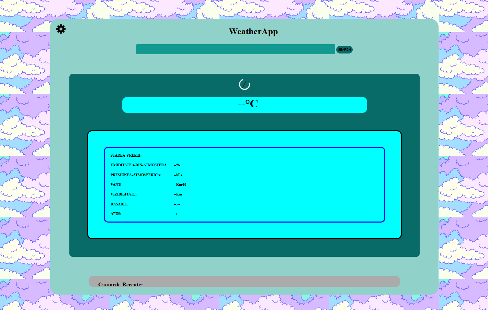
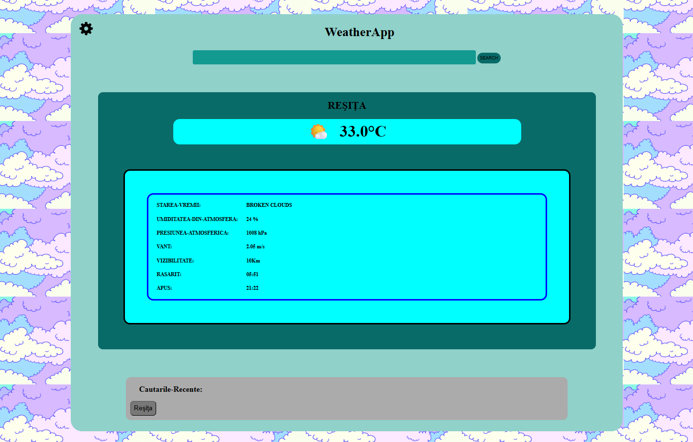
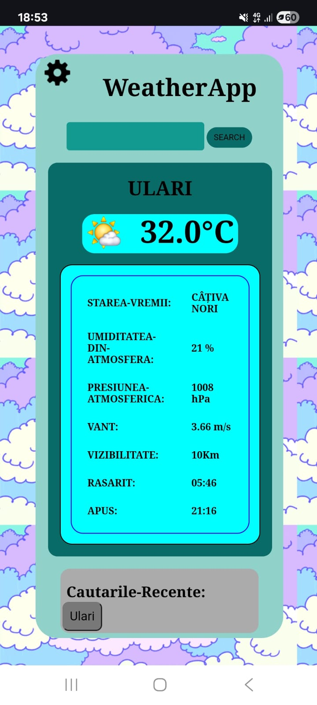
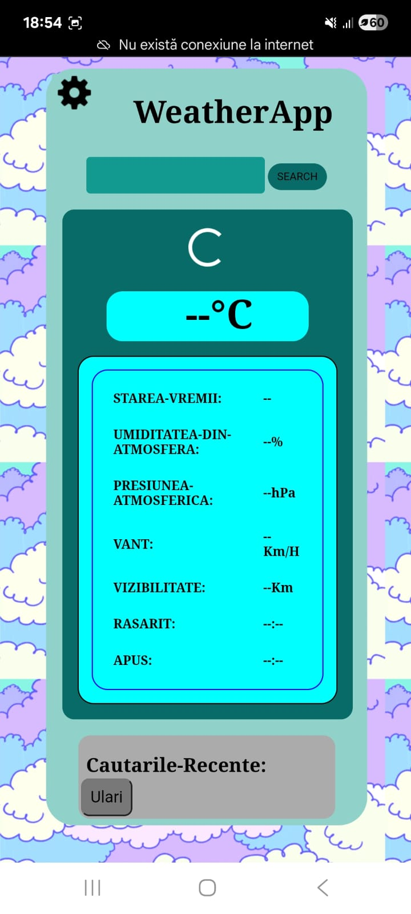
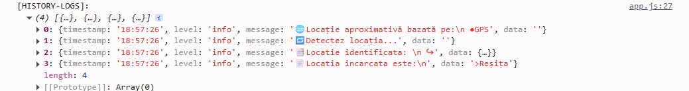

# 🌤️ Weather App - Aplicație Meteo Modernă în Vanilla JavaScript

> Aplicație web completă care oferă date meteo în timp real, construită cu JavaScript pur și integrând API-uri reale și tehnici moderne.

[Demo Live](https://weather-app-eight-mu-56.vercel.app) | [Cod Sursă](https://github.com/BogdanMinShow/Weather-App)

---

## 🎯 Despre Proiect

Această aplicație meteo permite utilizatorilor să afle rapid starea vremii în aproape orice oraș din lume. Folosind API-ul OpenWeatherMap, aplicația afișează temperatura curentă, condițiile atmosferice, viteza vântului, umiditatea și alte date relevante.

Un mare plus al aplicației este detectarea automată a locației utilizatorului prin Geolocation API, cu fallback la localizarea IP-ului în caz că permisiunea este refuzată. Interfața este modernă, responsive și ușor de utilizat, iar istoricul căutărilor este salvat local pentru acces rapid ulterior.

---

## ✨ Funcționalități

### Funcții de bază

- Detectare automată a locației utilizatorului (Geolocation API).
- Fallback localizare bazată pe IP în cazul refuzului permisiunii.
- Căutare manuală după oraș.
- Afișare detaliată a datelor meteo: temperatură, condiții, viteză vânt, umiditate, presiune.
- Conversie între Celsius și Fahrenheit.
- Istoric căutări salvate localStorage cu posibilitate de acces rapid.
- Design responsive, optimizat pentru desktop și mobil. [X]
- Mesaje clare de eroare și feedback instant pentru utilizator. [X]

### Funcții avansate

- Actualizare automată a datelor la intervale setate. [X]
- Temă dinamică Light/Dark în funcție de ora zilei. [X]
- Tranziții și animații subtile în UI.
- Cod modular ES6, folosind module JavaScript.

---

## 🛠️ Tehnologii Utilizate

- **Vanilla JavaScript (ES6 Modules)**
- **HTML5 & CSS3 (Flexbox/Grid)**
- **OpenWeatherMap API** pentru date meteo
- **Geolocation API** și **IP Geolocation API**
- **localStorage** pentru salvarea istoricului
- **Vercel** pentru hosting demo

---

## 🚀 Demo și Screenshots

Demo live disponibil aici:  
[https://weather-app-eight-mu-56.vercel.app](https://BogdanMinShow.github.io/Weather-App)

### 📸Screenshots

## Screenshot Desktop (ON):

===========================
## Screenshot Desktop (OFF):

===========================
## Screenshot Mobile (ON):

===========================
## Screenshot Mobile (OFF):

===========================
## Istoric Căutări:


---

## 📦 Instalare și Rulare

### Cerințe

- Browser modern (Chrome, Edge)
- Cheie API OpenWeatherMap **(gratuită)** 📛genereaza errori📛

### Setup local

```bash
git clone https://github.com/BogdanMinShow/Weather-App.git
cd Weather-App

# Deschide modules/config.js și adaugă cheia ta API
# export const API_KEY = 'cheia-ta-aici';

# Deschide index.html în browser
```
## 👤 Autor

**Pasca Bogdan** (aka _BogdanMinShow_)

- 💼 GitHub: [@BogdanMinShow](https://github.com/BogdanMinShow)
- 💠 LinkedIn: [@PascaBodgan](www.linkedin.com/in/pasca-bogdan-4a469a366)